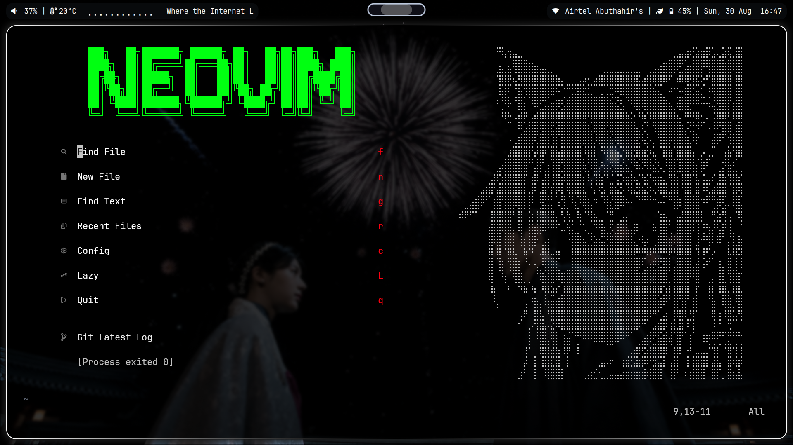

# My Neovim Configuration

<div align="center">


**A blazingly fast, heavily customized Neovim configuration built with lazy.nvim.**

*Tailored for a VS Code-like experience with modern development workflows.*

</div>



<hr>

## Features

* **Plugin Management:** Fully declarative setup using `lazy.nvim`.

* **LSP & Autocompletion:** Native LSP powered by `mason.nvim` and `nvim-lspconfig`, featuring zero-config setups for `vtsls`, `biome`, `pyright`, and `emmet_ls`.

* **Syntax & Formatting:** `nvim-treesitter` for flawless syntax highlighting and precise JSX/TSX indentation. Format-on-save integrated via Biome.

* **Navigation:** Fast fuzzy finding with `telescope.nvim` and a VS Code-style sidebar using `neo-tree`.

* **UI & Aesthetics:** Beautiful custom status line (`lualine`), tab buffers (`bufferline`), and custom git gutter signs (`gitsigns`).

* **Web Dev Perks:** Built-in auto-tag closing (`nvim-ts-autotag`) and Emmet snippet expansion for rapid UI development.

<hr>

## Prerequisites

Before installing this config, ensure you have the following installed on your system:

* **Neovim** (>= 0.9.0)
* **Git** (for lazy.nvim and gitsigns)
* **Ripgrep** (required for Telescope's fast live grep)
* **A Nerd Font** (e.g., FiraCode Nerd Font) configured in your terminal for icons.
* *(Optional)* A terminal that supports Kitty Graphics Protocol or Sixel (if using image previewers).

<hr>

## Installation

1. **Backup your existing config:**
   ```bash
   mv ~/.config/nvim ~/.config/nvim.bak
   mv ~/.local/share/nvim ~/.local/share/nvim.bak

2. **Clone this repository:**
    ```bash
    cd ~/.config
    git clone https://github.com/Safaizal/nvim.git

3. Start Neovim:
    ```bash
    nvim

lazy.nvim will automatically bootstrap and install all plugins. Mason will automatically download the language servers.

<hr>

## Folder Structure

My configuration is broken down into modular files for easy maintenance:

```
~/.config/nvim
  ├── colors
  ├── lua
  │   ├── config
  │   │   └── lazy.lua
  │   ├── lualine
  │   │   └── themes
  │   ├── plugins
  │   │   ├── autopairs.lua
  │   │   ├── bg.lua
  │   │   ├── bufferline.lua
  │   │   ├── colorscheme.lua
  │   │   ├── commenting.lua
  │   │   ├── completions.lua
  │   │   ├── dashboard.lua
  │   │   ├── gitsigns.lua
  │   │   ├── indent-backline.lua
  │   │   ├── lsp-config.lua
  │   │   ├── lualine.lua
  │   │   ├── ipynb.lua
  │   │   ├── render-markdown.lua
  │   │   ├── neotree.lua
  │   │   ├── noitfy.lua
  │   │   ├── none_ls.lua
  │   │   ├── telescope.lua
  │   │   └── treesitter.lua
  │   └── vim-conf.lua
  ├── README.md
  ├── init.lua
  └── lazy-lock.json
